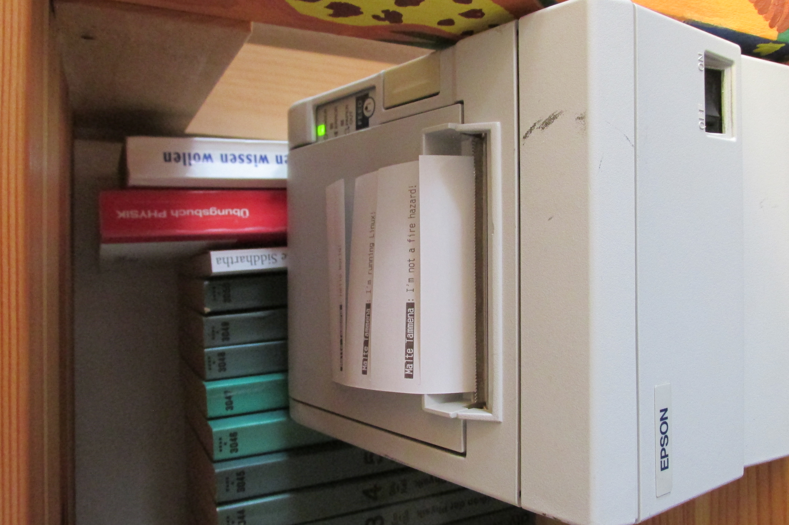

# Thermal Printer Shenanigans

This workspace contains all software related to the upcycling of my Epson TM-T88III.
The (*still undocumented*) hardware extension feature the [Pi Zero W](https://www.raspberrypi.org/products/raspberry-pi-zero-w/)
which interfaces with the printer's [RS232](https://en.wikipedia.org/wiki/RS-232) using the [MAX232](https://en.wikipedia.org/wiki/MAX232).
I had no issues supplying the Pi and the MAX232 + capacitors with enough current using a step-down converter on the printer-native 24V supply.
The TM-T88III is spacious enough to easily fit all components inside the enclosure, leaving a slick albeit very ugly view!

## Members

### [escpos-lib](./escpos-lib)
A simple (and very untested) library to map easy commands into the [ESC/POS](https://en.wikipedia.org/wiki/ESC/P) language to control the printer. **Do not use this, use [escpos-rs](https://lib.rs/crates/escpos-rs) instead**. I didn't because I was interested in the experience and my printer is not a USB-device.

### [printer-bot](./printer-bot)
A Telegram bot printing everything send to it. Nicely extended with simple permissions and a very rudimentary systemd service.

### [shopping-bon-bot](./shopping-bon-bot) (WIP)
Another Telegram bot that might actually be usefull at some point. Keeping track of my shopping list, sorting it according to my personal preferences (i.e. the order in which I grab things in my local grocery store) and, of course, printing it when called for.

### [print-bin](./print-bin) (WIP)
Just a testing tool, to make sure everything is working, mostly a binary to the `escpos-lib` library.

